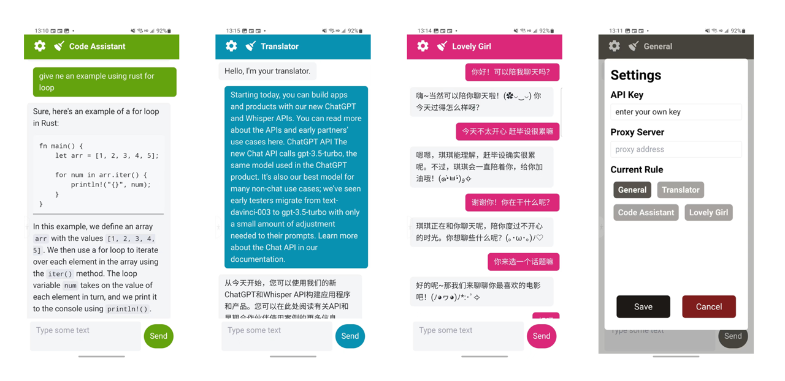

# gpt-react-ui
simple configurable typescript + react webapp for chatting with GPT or requesting other OpenAI APIs 

简单可配置的TypeScript + React Web应用，用于与GPT聊天或请求其他OpenAI APIs

**Current Features** | 当前功能:
- Easy-to-use chatroom | 简单易用的聊天交互
- Mobile first design | 移动设备优先
- Markdown renderer for GPT's answer | 对GPT回答的Markdown渲染器
- Switch different roles in use | 使用时切换不同GPT人设
- Users can input API Key and Proxy Server in use | 用户可以在使用中填入API Key和代理服务器
- Quick add pre-defined roles | 快速添加预定义的人设
- Static deployment | 静态网站部署

## Screenshot | 屏幕截图


## Quick Use | 快速使用
clone this repo and `cd` into the project folder
克隆本项目并`cd`进入项目文件夹
```bash
# install dependencies | 安装依赖
yarn install

# run in development mode | 开发模式运行
yarn start

# build deployable static site | 构建可部署的静态网站
yarn build
```

## Add Pre-config Rules | 添加预设的人设
修改`rules.ts`
```ts
export const rules: Rule[] = [
    // ...
    {
        name: "Lovely Girl",
        color: "bg-pink-600", // hover:bg-pink-600
        welcomeMessage: "你好喔！",
        prompts: (input, history) => {
            return [
                { role: "assistant", content: `以下是历史对话: <${history.join(" | ")}> | ` },
                { role: "user", content: `Q: ${input}。` },
                { role: "system", content: "请扮演一个叫琪琪的可爱的女孩子继续上面的对话。适当用软萌颜文字，主动陪伴，精简回答。A: " },
            ]
        }
    }
]
```